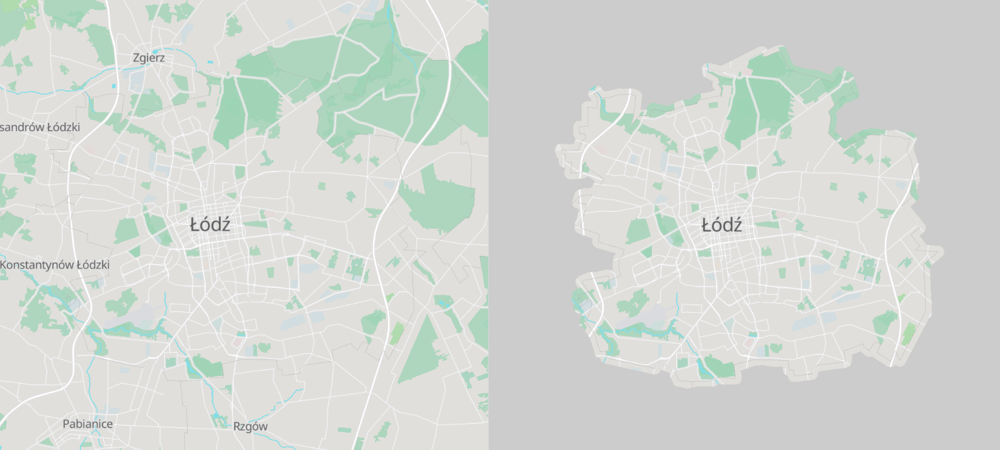
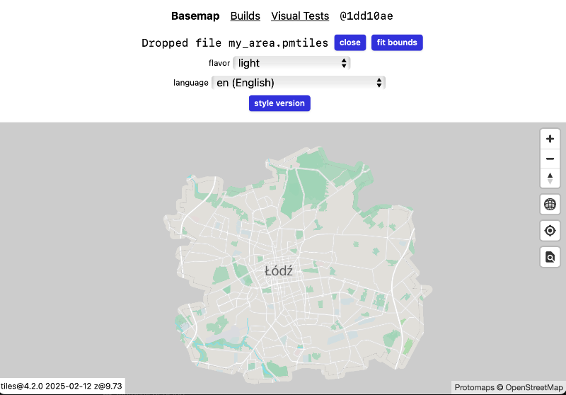

# Building a custom basemap

The Protomaps Basemap based on OpenStreetMap data is provided as a [free daily planet build](/basemaps/downloads), which can be downloaded in full, or extracted into sub-pyramids for certain areas.

The pipeline to generate this daily basemap [is open source](https://github.com/protomaps/basemaps/tree/main/tiles) and based on the [Planetiler](https://github.com/onthegomap/planetiler) Java tiling engine. It can be run for your local city or country in minutes, or in about two hours for the planet on a high-end desktop or server.

Advantages to generating basemaps yourself include:

* **Data** - Build tiles from specific OpenStreetMap snapshots, such as up-to-the-minute data from [SliceOSM](https://slice.openstreetmap.us).
* **Customization** - modify the Java code to include custom tags.
* **Clipping** - build a custom, focused area map. Extracting an area from the daily planet build will include extra data in low zoom tiles, like in the below illustration:



## Build a local map

To start you will need:

* a [Java Runtime Environment version 21+](https://github.com/onthegomap/planetiler/blob/main/CONTRIBUTING.md) and [Maven](https://maven.apache.org/install.html) installed.

* An OpenStreetMap extract that covers your area of interest, such as an on-demand download from [SliceOSM](https://slice.openstreetmap.us) or a pre-generated download from [Geofabrik Downloads](https://download.geofabrik.de).

* A GeoJSON administrative boundary for Łódź, Poland downloaded from the [Who's On First Spelunker](https://spelunker.whosonfirst.org/id/101913783). [Link to lodz.geojson](https://spelunker.whosonfirst.org/id/101913783/geojson)

### Generate the map

1. Create a checkout of the `basemaps` project and build the JAR.

```sh
git clone https://github.com/protomaps/basemaps
cd tiles
mvn clean package
```

2. Place your input OSM data into `data/sources` and run the tile generation JAR:

```sh
cp my_area.osm.pbf data/sources/my_area.osm.pbf
java -jar target/protomaps-basemap-HEAD-with-deps.jar --clip=lodz.geojson --area=my_area --download
```

This will also download resources such as pre-processed OSM water and land polygons, [Natural Earth](https://naturalearthdata.com), and datasets for language support and ranking.

3. Drag-and-drop your output `.pmtiles` to the [Basemaps Viewer at maps.protomaps.com](https://maps.protomaps.com):



## Build the planet

The recommended system requirements for building a planet tileset are:

* CPU: As many CPU cores as possible. Recommended: Intel Core i9 series, AMD Ryzen 9 series, AWS `c7gd.8xlarge` or equivalent.
* RAM: 64GB of RAM.
* Storage: At least 1TB of NVMe SSD storage, or attached instance store on a VPS (not network-attached storage)

Building the planet works the same way as before, but provide a Planet file from [planet.openstreetmap.org](http://planet.openstreetmap.org) as the `--area` argument, or `--osm_file` with a complete path and `--bounds=planet`.

```sh
java -Xmx20g -jar target/protomaps-basemap-HEAD-with-deps.jar --nodemap-type=array --osm_path=/data/planet-latest.osm.pbf --output=/data/planet.pmtiles --bounds=planet --tmpdir=/var/scratch
```

* `-Xmx20g`: Give the Java runtime environment 20GB of heap space.
* `--nodemap-type=array`: a build option best for planet tile generation.
* `--tmpdir=/var/scratch`: ensure there is at least 512GB of scratch space.


