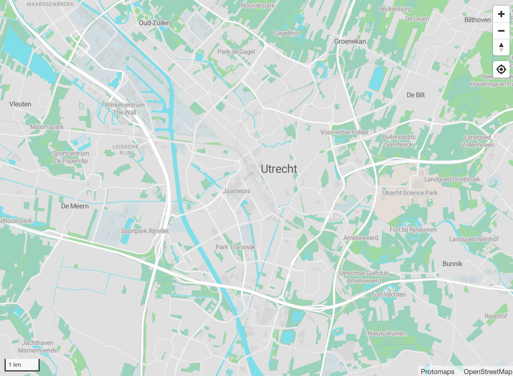

<script setup>
  const today = new Date();
  const yesterday = new Date(today);
  yesterday.setDate(yesterday.getDate() - 1);
  const yyyy = yesterday.getFullYear();
  let mm = yesterday.getMonth() + 1; // Months start at 0!
  let dd = yesterday.getDate();
  if (dd < 10) dd = '0' + dd;
  if (mm < 10) mm = '0' + mm;
  const dateNoDashes = `${yyyy}${mm}${dd}`;
  const dateDashes = `${yyyy}-${mm}-${dd}`;
</script>

# Getting Started

## 1. Install the CLI

The **pmtiles CLI tool** is a single binary you can download at [GitHub Releases](https://github.com/protomaps/go-pmtiles/releases).

## 2. Find the latest daily planet

Go to [maps.protomaps.com/builds](https://maps.protomaps.com/builds/) and find a recent daily basemap build.

Use the pmtiles CLI to inspect that archive:

```bash-vue
pmtiles show https://build.protomaps.com/{{ dateNoDashes }}.pmtiles
```

```txt-vue
...
planetiler:osm:osmosisreplicationtime {{ dateDashes }}T05:00:00Z
...
```

The above metadata shows that the file contains [OpenStreetMap](http://openstreetmap.org) data up to that day.

## 3. Extract any area

We can now create a subset of the planet file, `my_area.pmtiles`, with just tiles matching the bounding box `4.742883,51.830755,5.552837,52.256198` centered around Utrecht, Netherlands.

```bash-vue
pmtiles extract https://build.protomaps.com/{{ dateNoDashes }}.pmtiles my_area.pmtiles --bbox=4.742883,51.830755,5.552837,52.256198
```

> **Note:** You can find the bounding box of your own area, using tools, such as [http://bboxfinder.com/](http://bboxfinder.com/#51.830755,4.742883,52.256198,5.552837)

## 4. View the basemap

[maps.protomaps.com](https://maps.protomaps.com) is a viewer for basemaps. Drag our file `my_area.pmtiles` onto the `Drop Zone` to view the map:



## Next Steps

* Upload your tiles to cloud storage: [Cloud Storage](/pmtiles/cloud-storage)
* Change the appearance or theme of the basemap: [Basemap Styles](/basemaps/styles)
* Bring your own datasets: [Creating PMTiles](/pmtiles/create)
